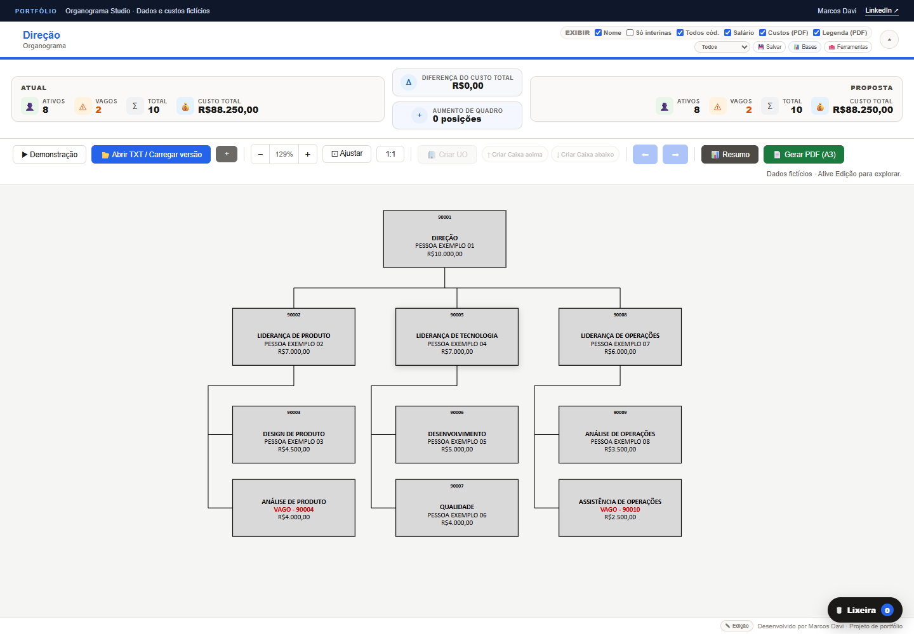

# Organograma Studio

**Ferramenta visual para planejamento de estruturas organizacionais e apoio à tomada de decisão.**

  <a href="https://xmarcosdavi.github.io/organograma-studio/"><strong>Acessar demonstração</strong></a>
  ·
  <a href="https://www.linkedin.com/in/marcosdavi-adm/">Falar com Marcos Davi</a>

## Sobre o projeto

O **Organograma Studio** foi criado por **Marcos Davi** para transformar dados de quadro em uma visão clara da organização. A solução permite representar hierarquias, comparar a estrutura atual com cenários propostos, acompanhar indicadores e preparar documentos gerenciais.

O projeto combina experiência em Recursos Humanos com desenvolvimento de software para resolver um problema real de gestão de pessoas.

## O que a solução oferece

- Visualização de estruturas e relações hierárquicas
- Comparação entre cenário atual e proposta organizacional
- Indicadores de quadro para apoio à análise
- Gestão de alterações e requisições de pessoal
- Resumo gerencial de propostas
- Geração de documentos em PDF
- Funcionamento local pelo navegador

## Demonstração pública

A versão publicada é uma **vitrine interativa limitada**, com telas e dados fictícios. Ela apresenta a experiência do produto sem disponibilizar os módulos internos, as regras de negócio ou o código-fonte da aplicação completa.

[**Abrir a demonstração →**](https://xmarcosdavi.github.io/organograma-studio/)

## Tecnologias

`JavaScript` · `HTML` · `CSS` · `Python` · `Git` · `GitHub Pages`

## Autoria e contato

Desenvolvido por **Marcos Davi**.

[LinkedIn](https://www.linkedin.com/in/marcosdavi-adm/)

## Direitos de uso

Copyright © 2026 Marcos Davi. Todos os direitos reservados. Este material é disponibilizado somente para avaliação e apresentação do projeto. Consulte [LICENSE.md](LICENSE.md).
